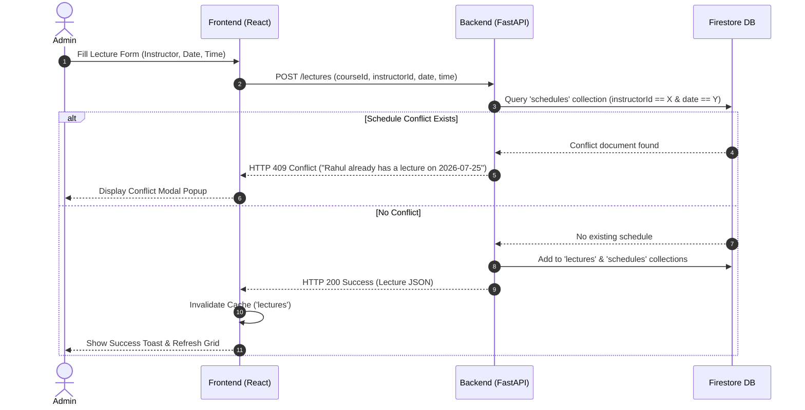

<div align="center">

  # 🎓 LecSchedule — Online Lecture & Course Management System

  **A conflict-free, intelligent lecture scheduling platform for educational institutions and online learning platforms.**

  [](https://reactjs.org/)
  [](https://fastapi.tiangolo.com/)
  [](https://firebase.google.com/)
  [](https://cloudinary.com/)
  [](https://online-lecture-scheduling-nine.vercel.app)
  [](https://online-lecture-scheduling-b8nv.onrender.com)

  <br />

  [🌐 **Live Web Application**](https://online-lecture-scheduling-nine.vercel.app) • [⚡ **Live API Documentation**](https://online-lecture-scheduling-b8nv.onrender.com/docs)

</div>

---

## 🌟 Overview

**LecSchedule** simplifies course administration and instructor scheduling. Built using **React (Vite)**, **FastAPI**, **Firebase Firestore**, and **Cloudinary**, it automatically detects and prevents scheduling conflicts, ensuring that no instructor is assigned multiple lectures on the same date.

Whether you're managing multiple batches or tracking individual instructor agendas, **LecSchedule** provides an intuitive, high-performance workspace for admins and instructors alike.

---

## ✨ Key Features

### 🛡️ Dual Portal Access (Role-Based Control)
- **Admin Portal**: Complete control over course creation, image uploads, lecture scheduling, and instructor tracking.
- **Instructor Portal**: Personalized dashboard and calendar view showing assigned lectures, dates, times, and batch details.

### 🛑 Smart Conflict Detection Engine
- Enforces scheduling rules: **An instructor can only be assigned to a single lecture per date**.
- Instant conflict check during scheduling: returns `HTTP 409` with clear error explanations.
- Real-time popup resolution without breaking form state or reloading the page.

### ⚡ Centralized In-Memory Caching (DataCacheContext)
- Zero-dependency, TTL-based caching layer in React Context.
- Instant page transitions with zero spinner flickering.
- Automatic invalidation on mutation: adding or deleting a course/lecture immediately updates all connected components across the app.

### 🖼️ Cloud-Based Media Storage
- Seamless image uploading via **Cloudinary API**.
- Automatic fallback image placeholders for courses without custom covers.

### 📅 Interactive Monthly Calendar Views
- Full visual calendar grid for both Admins and Instructors.
- Clickable date cells to inspect scheduled lectures by day.
- Past-time check: prevents scheduling lectures in the past for today's date.

---

## 🚀 Live Demo & Credentials

- **Frontend App (Vercel)**: [https://online-lecture-scheduling-nine.vercel.app](https://online-lecture-scheduling-nine.vercel.app)
- **Backend API (Render)**: [https://online-lecture-scheduling-b8nv.onrender.com](https://online-lecture-scheduling-b8nv.onrender.com)
- **API Health Check (Cron Ping)**: [https://online-lecture-scheduling-b8nv.onrender.com/health](https://online-lecture-scheduling-b8nv.onrender.com/health) *(Returns 17 bytes: `{"status":"ok"}`)*
- **API Swagger Docs**: [https://online-lecture-scheduling-b8nv.onrender.com/docs](https://online-lecture-scheduling-b8nv.onrender.com/docs)

### 🔑 Demo Login Accounts

| Role | Portal | Email | Password |
| :--- | :--- | :--- | :--- |
| **Admin** | Admin Portal | `admin@lecschedule.com` | `Password@123` |
| **Instructor** | Instructor Portal | `rahul@lecschedule.com` | `Password@123` |
| **Instructor** | Instructor Portal | `priya@lecschedule.com` | `Password@123` |
| **Instructor** | Instructor Portal | `aman@lecschedule.com` | `Password@123` |

*(Note: Clicking any demo button on the login screen automatically populates the form).*

---

## 📋 Comprehensive Validation Matrix

All input data, authentication credentials, and scheduling logic undergo multi-layered validation across the frontend client and backend API:

| Validation Target | Layer | Enforcement Location | Trigger Rule / Logic | Response & Handling |
| :--- | :--- | :--- | :--- | :--- |
| **Instructor Date Conflict** | **Backend API** | `backend/routers/lectures.py` | Checks Firestore `schedules` collection for existing `(instructorId, date)` pair | Returns `HTTP 409 Conflict`. Frontend opens dedicated Conflict Resolution Modal |
| **Past-Time Prevention** | **Frontend** | `frontend/src/pages/admin/CourseDetail.jsx` | If selected `lectureDate === today`, verifies `startTime > currentTime` | Prevents submit, displays inline alert: *"Start time has already passed for today"* |
| **Chronological Time Order** | **Frontend** | `frontend/src/pages/admin/CourseDetail.jsx` | Verifies `startTime < endTime` | Prevents submit, displays inline alert: *"End time must be after start time"* |
| **Portal Access Control (RBAC)** | **Frontend** | `frontend/src/pages/Login.jsx` | Matches Firestore profile `role` against selected portal (`admin` vs `instructor`) | Denies access, logs out user, displays toast: *"Wrong portal — this is an Admin/Instructor account"* |
| **Firebase ID Token Validity** | **Backend API** | `backend/routers/auth.py` | `firebase_auth.verify_id_token(idToken)` checks JWT signature, `iat`, and `exp` | Returns `HTTP 401 Unauthorized` with exact failure reason |
| **Required Form Fields** | **Frontend** | `AddCourse.jsx`, `CourseDetail.jsx` | Checks that title, course, batch, instructor, date, start & end times are non-empty | Blocks form submission & highlights missing fields in red |
| **Course Image MIME & File Type** | **Frontend** | `frontend/src/pages/admin/AddCourse.jsx` | Checks `file.type.startsWith("image/")` | Displays toast: *"Please select an image file"* |
| **Environment Credential Parsing** | **Backend** | `backend/firebase_config.py` | Checks string format: raw JSON (`startsWith("{")`) vs Base64 (`b64decode`) | Gracefully throws `ValueError` during boot if credentials format is corrupted |

---

## 📈 Scalability Architecture

The application is engineered to handle growing datasets and high concurrent user traffic efficiently:

### 1. Fast Indexing with Denormalized Lookup
- Instead of performing costly nested queries across all lectures, the system maintains a dedicated **`schedules` Firestore collection**.
- Conflict checks execute an indexed $O(1)$ query on `(instructorId, date)`, ensuring instant response times even as the total lecture volume grows into millions.

### 2. Client-Side In-Memory Data Caching (`DataCacheContext`)
- Implements a TTL-based (5-minute) in-memory cache for API resources (`courses`, `instructors`, `lectures`).
- **Eliminates Redundant Network Requests**: Navigating between pages consumes cached data instantly.
- **Selective Mutation Invalidation**: Adding or deleting resources triggers pattern-based invalidations (`invalidatePattern("lectures")`), ensuring data freshness across components without over-fetching.

### 3. Asynchronous Non-Blocking Backend
- Built on **FastAPI** and **Uvicorn**, leveraging Python's `asyncio` loop for high-throughput I/O bound operations.

### 4. Stateless Container Architecture
- The FastAPI backend maintains no in-memory session state. All session information resides in cryptographically signed Firebase JWTs.
- This allows **horizontal scaling** (adding more container instances on Render or serverless environments) behind a load balancer without sticky sessions.

### 5. Media Content Delivery Network (CDN)
- Course cover images are stored and processed on **Cloudinary's Global CDN**, offloading asset delivery from the backend server and guaranteeing fast load times globally.

---

## 🛡️ Security Model

### 1. Cryptographic Authentication & Token Verification
- Authentication is handled via **Firebase Auth**.
- The backend verifies Firebase-signed Bearer ID tokens on protected API endpoints using the **Firebase Admin SDK**.

### 2. Strict Cross-Origin Resource Sharing (CORS) Policy
- Backend CORS configuration in `backend/main.py` explicitly restricts allowed origins:
  ```python
  allow_origins=["http://localhost:5173", "https://online-lecture-scheduling-nine.vercel.app"]
  allow_origin_regex=r"https://.*\.vercel\.app"
  ```
- Prevents unauthorized cross-site requests while allowing Vercel deployment URLs.

### 3. Global Exception Handler & CORS Leak Protection
- Standard FastAPI 500 errors can omit CORS headers, causing browsers to display misleading CORS errors.
- A custom global exception handler in `main.py` catches all unhandled server exceptions and attaches appropriate CORS headers, preserving security while surfacing clear diagnostic error messages.

### 4. Secret Isolation & Zero Hardcoded Credentials
- Service account private keys and API credentials are kept out of source control via `.gitignore`.
- Supports raw JSON strings and Base64-encoded strings (`FIREBASE_CREDENTIALS_JSON`) for safe environment variable injection on cloud platforms like Render.

---

## 🛠️ Tech Stack

| Domain | Technology | Purpose |
| :--- | :--- | :--- |
| **Frontend** | React 18 (Vite), JavaScript | Single Page Application framework |
| **Styling** | Custom Design Tokens (Vanilla CSS) | Warm, glassmorphism UI with micro-animations |
| **Icons & Alerts** | Lucide React, React Hot Toast | Modern UI iconography & notifications |
| **Backend** | Python 3.11+, FastAPI | Asynchronous RESTful API framework |
| **Database** | Firebase Firestore | NoSQL Cloud Database |
| **Authentication** | Firebase Admin SDK + Client Auth | Token verification & user security |
| **Image Hosting** | Cloudinary API | Cloud storage for course thumbnails |
| **Hosting** | Vercel (Frontend) & Render (Backend) | Global CI/CD deployment |

---

## 📂 Project Structure

```text
Online_course_management/
├── backend/
│   ├── main.py              # FastAPI entry point & CORS configuration
│   ├── firebase_config.py   # Firebase Admin SDK initialization (JSON / Base64)
│   ├── requirements.txt     # Python backend dependencies
│   ├── models/              # Pydantic data schemas
│   │   ├── course.py
│   │   ├── lecture.py
│   │   └── user.py
│   └── routers/             # API Router modules
│       ├── auth.py          # Token verification endpoint (/auth/verify-token)
│       ├── users.py         # Instructor accounts & database seed (/users/seed)
│       ├── courses.py       # Course CRUD & Cloudinary file upload
│       └── lectures.py      # Lecture management & conflict checking
│
├── frontend/
│   ├── public/              # Static assets
│   ├── src/
│   │   ├── api.js           # Axios client configured with VITE_API_BASE_URL
│   │   ├── firebase.js      # Firebase client SDK initialization
│   │   ├── App.jsx          # Router & Protected route configuration
│   │   ├── index.css        # Core design system & theme variables
│   │   ├── context/
│   │   │   ├── AuthContext.jsx       # Firebase Auth & user profile state
│   │   │   └── DataCacheContext.jsx  # In-memory TTL data cache & invalidation
│   │   ├── components/
│   │   │   ├── Sidebar.jsx           # Responsive Navigation sidebar
│   │   │   └── Layout/               # Admin & Instructor layout wrappers
│   │   └── pages/
│   │       ├── Login.jsx             # Dual-portal choice & authentication
│   │       ├── admin/                # Dashboard, Courses, Instructors, Calendar
│   │       └── instructor/           # MyLectures, InstructorCalendarView
│   └── vercel.json          # SPA Client-side route rewrites
│
└── vercel.json              # Workspace root deployment rewrite rules
```

---

## ⚡ Quick Start (Local Development)

### 1. Prerequisites
- **Node.js**: v18.x or higher
- **Python**: v3.10 or higher
- **Firebase Account**: Firebase project with Firestore & Auth enabled
- **Cloudinary Account**: Cloud name, API Key, and Secret

---

### 2. Backend Setup

```bash
# Navigate to backend
cd backend

# Create virtual environment (optional but recommended)
python -m venv venv
source venv/bin/activate  # On Windows: venv\Scripts\activate

# Install dependencies
pip install -r requirements.txt

# Create .env file from template
cp .env.example .env
```

Fill in your environment variables in `backend/.env`:
```env
FIREBASE_CREDENTIALS_PATH=../data/lecschedule-firebase-adminsdk-fbsvc-8fc9c150f6.json
CLOUDINARY_CLOUD_NAME=your_cloud_name
CLOUDINARY_API_KEY=your_api_key
CLOUDINARY_API_SECRET=your_api_secret
FRONTEND_ORIGIN=http://localhost:5173
```

Start the FastAPI backend server:
```bash
uvicorn main:app --reload --port 8000
```
- API Endpoint: `http://localhost:8000`
- Interactive Documentation: `http://localhost:8000/docs`

---

### 3. Database Seeding (First Time Setup)

Run the seed command to create the default Admin and Instructor accounts in Firestore:

```bash
curl -X POST http://localhost:8000/users/seed
```

---

### 4. Frontend Setup

```bash
# Open a new terminal and navigate to frontend
cd frontend

# Install dependencies
npm install

# Create .env file
cp .env.example .env
```

Fill in your Firebase Web client configuration in `frontend/.env`:
```env
VITE_FIREBASE_API_KEY=your_api_key
VITE_FIREBASE_AUTH_DOMAIN=lecschedule.firebaseapp.com
VITE_FIREBASE_PROJECT_ID=lecschedule
VITE_FIREBASE_STORAGE_BUCKET=lecschedule.firebasestorage.app
VITE_FIREBASE_MESSAGING_SENDER_ID=your_sender_id
VITE_FIREBASE_APP_ID=your_app_id

VITE_API_BASE_URL=http://localhost:8000
```

Start the Vite development server:
```bash
npm run dev
```
Open [http://localhost:5173](http://localhost:5173) in your browser.

---

## 🔒 Conflict Checking Architecture



---

## 📄 Firestore Collection Schema

| Collection | Key Fields | Description |
| :--- | :--- | :--- |
| `users` | `name`, `email`, `role`, `designation` | Accounts with roles (`admin` or `instructor`) |
| `courses` | `name`, `level`, `description`, `imageUrl` | Course details & Cloudinary thumbnail |
| `lectures` | `courseId`, `lectureTitle`, `batch`, `instructorId`, `lectureDate`, `startTime`, `endTime`, `status` | Individual lecture schedules |
| `schedules` | `instructorId`, `lectureId`, `courseId`, `date` | Fast-lookup index for conflict verification |

---

## 🤝 Contributing

Contributions, issues, and feature requests are welcome! Feel free to check the [issues page](https://github.com/IqraS-gif/Online_Lecture_scheduling/issues).

---

## 📝 License

Distributed under the **MIT License**. See `LICENSE` for more information.

<div align="center">
  <sub>Built with ❤️ by Iqra. Designed for clarity, speed, and reliability.</sub>
</div>
